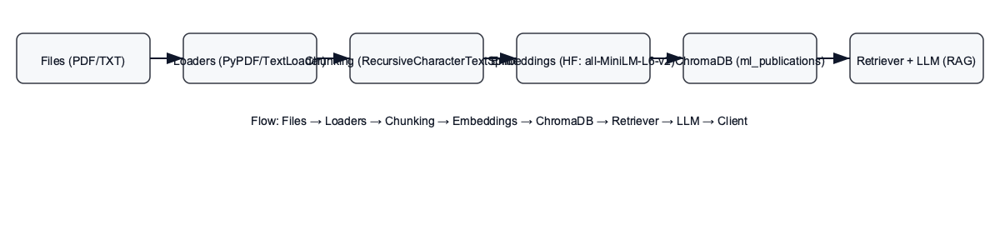

# Jacmate — RAG Research Assistant 🔎🤖

**Author:** Ugochukwu Febechukwu  
**Date:** 2026-01-06

---

## Abstract
This publication documents Jacmate — a Retrieval-Augmented Generation (RAG) assistant that ingests local research PDFs/TXT into a persistent ChromaDB vector store, uses LangChain utilities for loading, chunking, and embeddings, and calls OpenAI chat models (via LangChain) to generate concise, human-readable answers to user research queries.

---

## Table of contents
- [Project overview](#project-overview)
- [Architecture diagram](#architecture-diagram)
- [Data ingestion (files → ChromaDB)](#data-ingestion-files--chromadb)
- [Chunking & Embeddings](#chunking--embeddings)
- [Insertion details (`insert_chroma.py` & `insert_publications`)](#insertion-details-insertchromepy--insert_publications)
- [Retrieval & RAG flow](#retrieval--rag-flow)
- [API & Client usage](#api--client-usage)
- [Model configuration & sample outputs](#model-configuration--sample-outputs)
- [Deployment, reproducibility & tips](#deployment-reproducibility--tips)
- [Security & best practices](#security--best-practices)
- [Contributing & license](#contributing--license)

---

## Project overview
Jacmate is structured to be easy to run locally and to extend for production. Key files:

- `inserting_file.py` — loads PDFs and `.txt` files using LangChain community loaders (`PyPDFLoader`, `TextLoader`).
- `jac_functions.py` — chunking, embedding, insertion into ChromaDB, search/retrieval helpers, and prompt construction.
- `insert_chroma.py` — example ingestion script that calls the ingestion flow and populates a persistent Chroma DB at `./research_db`.
- `app.py` — FastAPI server exposing `/ask` to query the RAG pipeline.
- `scripts/generate_publication.py` — generates `publication.docx`.

---

## Architecture diagram 🏗️



*Flow: Files → Loaders → Chunking → Embeddings → ChromaDB → Retriever → LLM → Client*

---

## Data ingestion (files → ChromaDB)

High-level flow:
1. Discover files (PDF/TXT) on disk.  
2. Load page text using LangChain loaders.  
3. Chunk long documents (overlapping windows) to preserve context.  
4. Embed chunks into dense vectors.  
5. Insert vectors + docs + metadata into a ChromaDB collection (`ml_publications`).

Example loader invocation (from `insert_chroma.py`):

```py
from inserting_file import load_pdf_to_strings
publication = load_pdf_to_strings("data/400 Level/1st Semester")
db = insert_publications(collection, publication, title="400 level")
```

Inserting runs `insert_publications` (see next section).

---

## Chunking & Embeddings

Chunking strategy (in `jac_functions.chunk_research_paper`):
- Chunk size: **1000 characters**
- Overlap: **200 characters**
- Separators prioritized: paragraphs, line breaks, sentence boundaries, spaces

This approach preserves continuity across chunk boundaries and improves retrieval recall.

Embedding model (used in `jac_functions.embed_documents`):
- `sentence-transformers/all-MiniLM-L6-v2` (via `langchain_huggingface.HuggingFaceEmbeddings`) — efficient and commonly used for semantic search.
- Device selection: auto-detects `cuda`, `mps`, or `cpu`.

Snippet (embedding call):

```py
model = HuggingFaceEmbeddings(
    model_name="sentence-transformers/all-MiniLM-L6-v2",
    model_kwargs={"device": device},
)
embeddings = model.embed_documents(documents)
```

---

## Insertion details (`insert_chroma.py` & `insert_publications`)

`insert_chroma.py` sets up the Chroma client and collection:

```py
client = chromadb.PersistentClient(path="./research_db")
collection = client.get_or_create_collection(
    name="ml_publications",
    metadata={"hnsw:space": "cosine"}
)
```

`insert_publications` (core logic in `jac_functions.py`):
- For each document, chunk it using `chunk_research_paper`.
- Extract chunk texts and call `embed_documents()` to get vectors.
- Build stable IDs and call `collection.add(embeddings=..., ids=..., documents=..., metadatas=...)`.

Key behavior considerations:
- `next_id = collection.count()` is used to avoid id collisions when adding multiple publications in the same run.
- Metadata stored with each chunk includes `title` and `chunk_id`, which helps when presenting sources to users.

---

## Retrieval & RAG flow

Search is implemented in `search_research_db`:
1. Embed the user query: `query_vector = embeddings.embed_query(query)`
2. Call Chroma `collection.query(...)` with `query_embeddings=[query_vector]`, `n_results=k`.
3. Return `documents`, `metadatas`, and `distances`.

Example snippet:

```py
results = collection.query(
    query_embeddings=[query_vector],
    n_results=top_k,
    include=["documents", "metadatas", "distances"]
)
```

`answer_research_question` builds the context and prompt, then calls the LLM:

```py
context = "\n\n".join([
    f"From {chunk['title']}:\n{chunk['content']}" for chunk in relevant_chunks
])
prompt = prompt_template.format(context=context, question=query)
response = llm.invoke(prompt)
return response.content, relevant_chunks
```

Notes:
- The prompt template is research-focused and asks the LLM to synthesize findings using the retrieved chunks as context.
- `llm.invoke(...)` is used because an LLM wrapper (e.g., LangChain's `ChatOpenAI`) is passed in.

---

## API & Client usage

The `app.py` FastAPI server handles requests to `/ask`. The endpoint instantiates embeddings and the LLM per request (simple approach) and calls `answer_research_question`:

```py
@app.post("/ask")
def ask_question(payload: QueryRequest):
    embeddings = HuggingFaceEmbeddings(model_name="all-MiniLM-L6-v2")
    llm_gpt = ChatOpenAI(model_name='gpt-4o-mini', temperature=0.7)
    answer, sources = answer_research_question(payload.question, collection, embeddings, llm_gpt)
    return {...}
```

Example Python client:

```py
import requests
payload = {'question': 'Summarize the primary contributions across these papers.'}
resp = requests.post('http://localhost:8000/ask', json=payload)
print(resp.json())
```

Curl example:

```bash
curl -X POST "http://localhost:8000/ask" -H "Content-Type: application/json" -d '{"question": "What are the main contributions in the ML papers?"}'
```
                        
---
                                                                                    